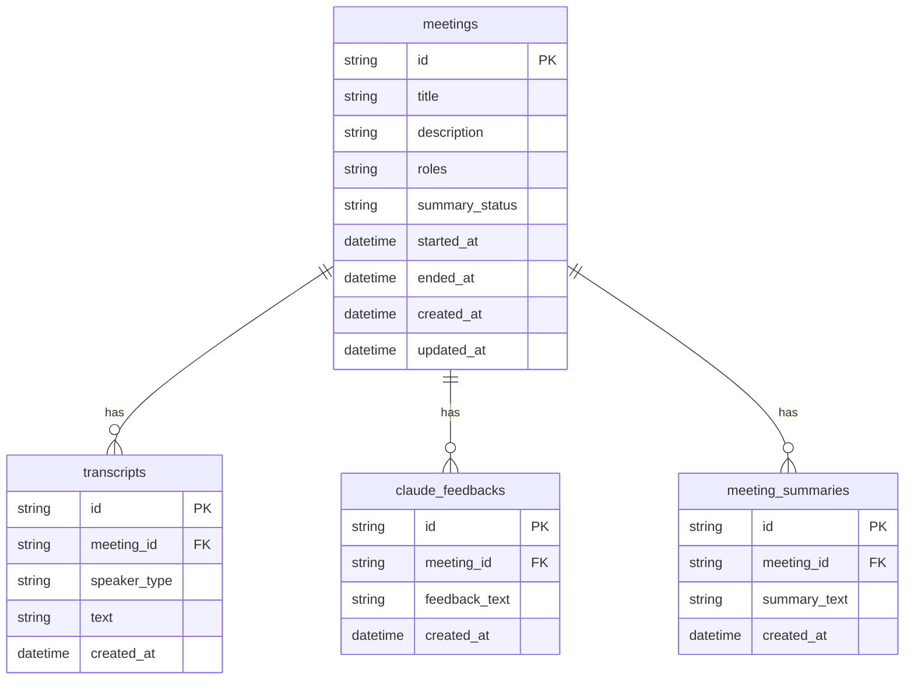

# DB テーブル定義

開発環境では SQLite、本番では PostgreSQL を想定する。両者の互換性を保つため、ID は文字列（CUID）、タイムスタンプは UTC で扱う。スキーマは Prisma で管理する。

## 1. テーブル一覧

| テーブル             | 用途                                |
| -------------------- | ----------------------------------- |
| `meetings`           | 会議そのもの。タイトルと期間を保持   |
| `transcripts`        | 発言ログ（speaker_type 付き）        |
| `claude_feedbacks`   | 議事中の Claude ヒアリング提案       |
| `meeting_summaries`  | 会議終了時の Claude 議事録            |

## 2. ER 図



## 3. テーブル定義

### 3.1 `meetings`

| カラム名     | 型             | NULL  | 既定値              | 説明                                |
| ------------ | -------------- | ----- | ------------------- | ----------------------------------- |
| `id`         | `string` (CUID) | NOT   |                     | 主キー                              |
| `title`      | `string(200)`  | NOT   |                     | 会議タイトル                        |
| `description` | `text`        | NULL  |                     | 会議の目的・内容（メタ情報）。フィードバック／議事録生成時にコンテキストとして渡す |
| `roles`      | `text`         | NULL  |                     | フィードバック対象ロールの JSON 配列文字列（例: `["sales","engineer"]`）。空・未選択時はロール非依存 |
| `summary_status` | `string(16)` | NULL |                     | 議事録生成の状態（`processing` / `done` / `error`）。バックグラウンド生成の進捗管理に使用 |
| `started_at` | `datetime`     | NOT   | `now()`             | 会議開始時刻（録音開始時に確定）    |
| `ended_at`   | `datetime`     | NULL  |                     | 会議終了時刻。終了 API で確定         |
| `created_at` | `datetime`     | NOT   | `now()`             | レコード作成時刻                    |
| `updated_at` | `datetime`     | NOT   | `now()` ON UPDATE   | レコード更新時刻                    |

- インデックス: `created_at DESC`（一覧画面の並び替え用）

### 3.2 `transcripts`

| カラム名       | 型             | NULL | 既定値    | 説明                                            |
| -------------- | -------------- | ---- | --------- | ----------------------------------------------- |
| `id`           | `string` (CUID) | NOT  |           | 主キー                                          |
| `meeting_id`   | `string`       | NOT  |           | `meetings.id` への外部キー（ON DELETE CASCADE） |
| `speaker_type` | `string(16)`   | NOT  |           | `self` / `partner`                              |
| `text`         | `text`         | NOT  |           | 発言テキスト（確定文のみ保存）                  |
| `created_at`   | `datetime`     | NOT  | `now()`   | 発話時刻                                         |

- インデックス: `(meeting_id, created_at)`（タイムライン取得）
- 値制約: `speaker_type IN ('self', 'partner')`（アプリ層で検証）

### 3.3 `claude_feedbacks`

| カラム名        | 型             | NULL | 既定値    | 説明                                            |
| --------------- | -------------- | ---- | --------- | ----------------------------------------------- |
| `id`            | `string` (CUID) | NOT  |           | 主キー                                          |
| `meeting_id`    | `string`       | NOT  |           | `meetings.id` への外部キー（ON DELETE CASCADE） |
| `feedback_text` | `text`         | NOT  |           | Claude が返した提案テキスト（Markdown 可）       |
| `created_at`    | `datetime`     | NOT  | `now()`   | 取得時刻                                         |

- インデックス: `(meeting_id, created_at)`

### 3.4 `meeting_summaries`

| カラム名       | 型             | NULL | 既定値    | 説明                                            |
| -------------- | -------------- | ---- | --------- | ----------------------------------------------- |
| `id`           | `string` (CUID) | NOT  |           | 主キー                                          |
| `meeting_id`   | `string`       | NOT  |           | `meetings.id` への外部キー（ON DELETE CASCADE） |
| `summary_text` | `text`         | NOT  |           | 議事録本文（Markdown）                          |
| `created_at`   | `datetime`     | NOT  | `now()`   | 作成時刻                                         |

- インデックス: `(meeting_id, created_at DESC)`
- 同一会議で再生成する運用を想定し、複数行を許容する（最新が最新の議事録）

## 4. Prisma スキーマ案

```prisma
generator client {
  provider = "prisma-client-js"
}

datasource db {
  provider = "sqlite" // 本番では postgresql
  url      = env("DATABASE_URL")
}

model Meeting {
  id            String    @id @default(cuid())
  title         String
  description   String?   @map("description")        // 会議の目的・内容（メタ情報）
  roles         String?   @map("roles")              // フィードバック対象ロールの JSON 配列文字列
  summaryStatus String?   @map("summary_status")     // 議事録生成の状態: processing | done | error
  startedAt     DateTime  @default(now()) @map("started_at")
  endedAt       DateTime? @map("ended_at")
  createdAt     DateTime  @default(now()) @map("created_at")
  updatedAt     DateTime  @updatedAt @map("updated_at")

  transcripts Transcript[]
  feedbacks   ClaudeFeedback[]
  summaries   MeetingSummary[]

  @@index([createdAt])
  @@map("meetings")
}

model Transcript {
  id          String   @id @default(cuid())
  meetingId   String   @map("meeting_id")
  speakerType String   @map("speaker_type") // 'self' | 'partner'
  text        String
  createdAt   DateTime @default(now()) @map("created_at")

  meeting Meeting @relation(fields: [meetingId], references: [id], onDelete: Cascade)

  @@index([meetingId, createdAt])
  @@map("transcripts")
}

model ClaudeFeedback {
  id           String   @id @default(cuid())
  meetingId    String   @map("meeting_id")
  feedbackText String   @map("feedback_text")
  createdAt    DateTime @default(now()) @map("created_at")

  meeting Meeting @relation(fields: [meetingId], references: [id], onDelete: Cascade)

  @@index([meetingId, createdAt])
  @@map("claude_feedbacks")
}

model MeetingSummary {
  id          String   @id @default(cuid())
  meetingId   String   @map("meeting_id")
  summaryText String   @map("summary_text")
  createdAt   DateTime @default(now()) @map("created_at")

  meeting Meeting @relation(fields: [meetingId], references: [id], onDelete: Cascade)

  @@index([meetingId, createdAt])
  @@map("meeting_summaries")
}
```

## 5. データライフサイクル

| 操作                         | 影響テーブル                                                    |
| ---------------------------- | --------------------------------------------------------------- |
| 「ミーティング開始」         | `meetings` に 1 行 INSERT（`started_at = now()`）               |
| 確定発話受信                 | `transcripts` に 1 行 INSERT                                    |
| 「フィードバック取得」       | `claude_feedbacks` に 1 行 INSERT                               |
| 「議事録を生成して終了」     | `meetings.ended_at` を UPDATE → `summary_status='processing'` に更新 → バックグラウンドで生成し、完了で `meeting_summaries` に 1 行 INSERT ＋ `summary_status='done'`（失敗時は `'error'`） |
| 会議削除（管理操作）         | `meetings` を DELETE → 関連 3 テーブルが CASCADE DELETE         |

## 6. 命名規約

- テーブル名は複数形スネークケース（`meetings`, `transcripts`）
- カラム名はスネークケース
- Prisma 側のフィールド名はキャメルケース、`@map` で物理名にマッピング

## 7. マイグレーション運用

- 初期マイグレーション（init）は `prisma migrate dev` で作成する。以降の列追加（`description` / `roles` / `summary_status` など）はマイグレーションファイルを作らず `npx prisma db push` でスキーマを反映する運用とする
- 本番反映は `prisma migrate deploy`
- SQLite → PostgreSQL の切替時は `datasource.provider` を変更し、再度初期マイグレーションを作り直す

## 8. 想定クエリ

```sql
-- 議事録一覧（新しい順）
SELECT id, title, started_at, ended_at
FROM meetings
ORDER BY created_at DESC
LIMIT 50;

-- 会議のタイムライン
SELECT id, speaker_type, text, created_at
FROM transcripts
WHERE meeting_id = ?
ORDER BY created_at ASC;

-- 最新の議事録
SELECT summary_text
FROM meeting_summaries
WHERE meeting_id = ?
ORDER BY created_at DESC
LIMIT 1;
```
