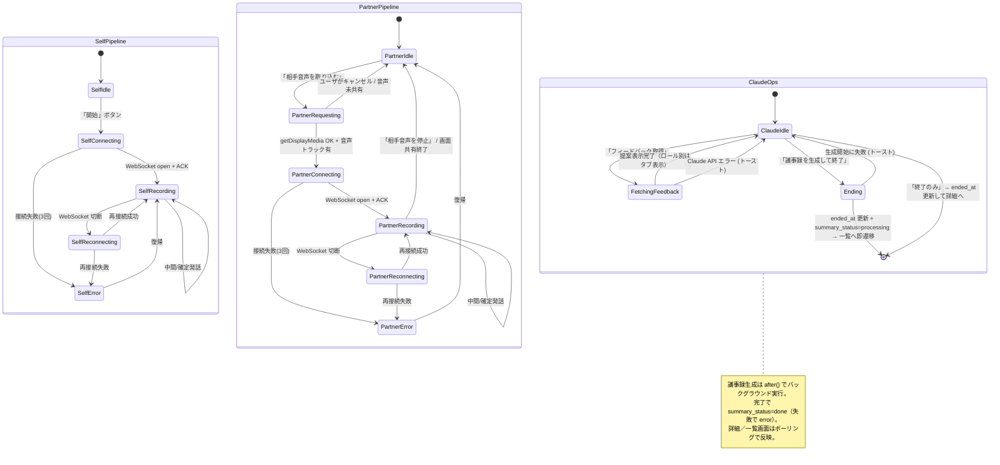
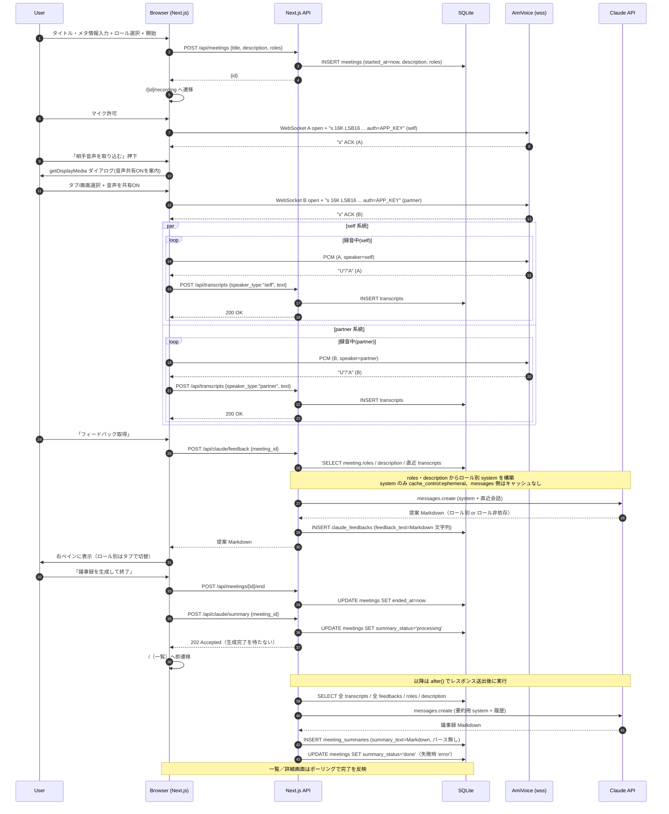
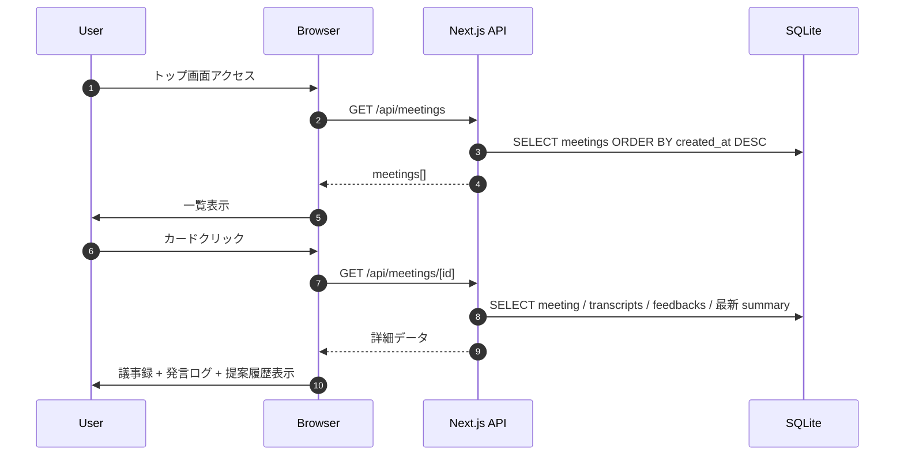
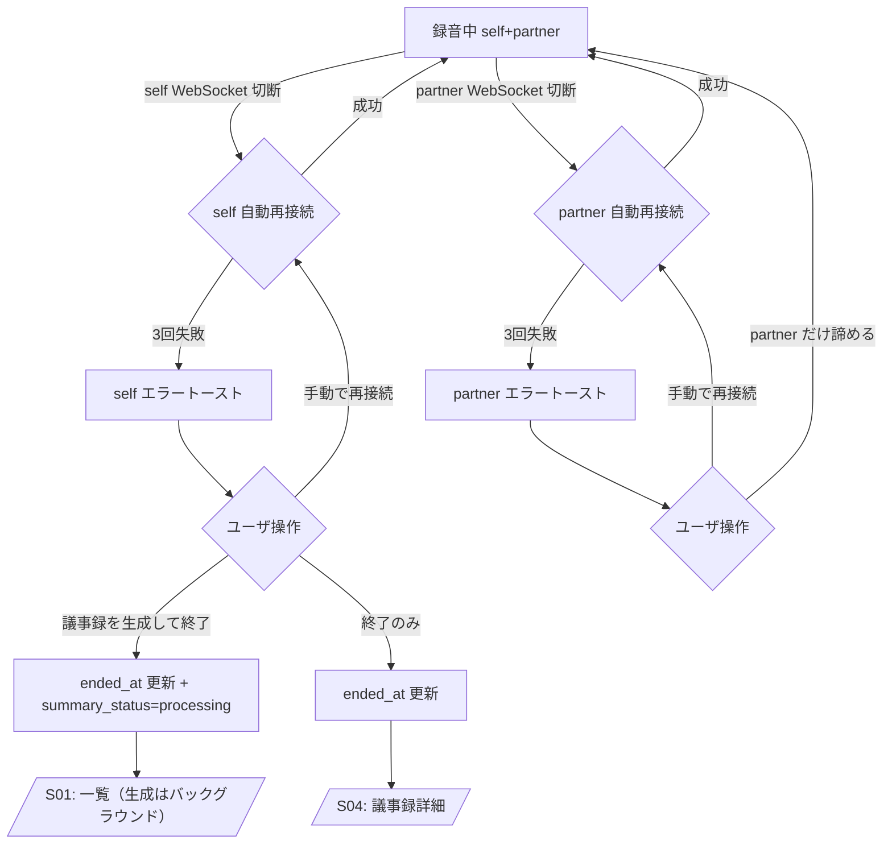

# 画面遷移図（Mermaid）

## 1. 画面遷移（全体）

```mermaid
flowchart LR
    Start([アプリ起動])
    S01[/S01: 議事録一覧 /]
    S02[/S02: 新規ミーティング作成 /new/]
    S03[/S03: 録音画面 /[id]/recording/]
    S04[/S04: 議事録詳細 /[id]/]

    Start --> S01
    S01 -->|新規ミーティング開始| S02
    S01 -->|カードクリック| S04
    S02 -->|タイトル・メタ情報入力 + ロール選択 + 開始| S03
    S02 -->|キャンセル| S01
    S03 -->|議事録を生成して終了（生成はバックグラウンド）| S01
    S03 -->|終了のみ| S04
    S03 -.->|戻る確認 → OK| S01
    S04 -->|一覧へ戻る| S01
    S04 -.->|録音画面へ（進行中の会議）| S03
```

## 2. 録音画面（S03）内部のステートフロー

self（マイク）と partner（ループバック）が独立に状態を持つ。Claude API 呼び出しはそれらと独立した上位イベント。



## 3. API シーケンス：ミーティング開始〜議事録保存



## 4. 一覧／詳細閲覧フロー



## 5. エラー復帰フロー


